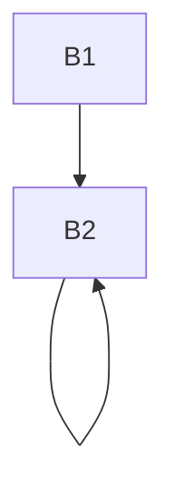

# HW12

### 9.1

> (a) 识别该流图的循环

​	针对回边：

- 4->3 : {B3, B4}

- 5->2 : {B2, B3, B4, B5} 

  内循环：{B2, B5} , {B2, B3, B5}

> (b) 可以对a和b的哪些引用实施复写传播并将这些传播替换成对常量的引用？

​	由于在B5中`b=a+b`的语句会改变b的值。因此对b的引用不能改成常量引用。

​	循环中不改变a的值，对a的引用可以改成常量引用。

​	`(3)c=a+b  =>  c=1+b`

​	`(4)d=c-a  =>  d=c-1`

​	`(6)d=a+b  =>  d=1+b`

​	`(8)b=a+b  =>  b=1+b`

​	`(9)e=c-a  =>  e=c-1`

> (c)识别每个循环的全局公共子表达式

- B2:  c=**a+b**  d=**c-a**

- B5:  b=**a+b**  e=**c-a**

- B4:  d=**a+b**

  因为B3/B4不改变a、b值)，故**a+b**和**c-a**为全局公共子表达式

*注：一个疑问，虽然c-a表达式的值没有变，但是左值d在B3,B4中可能改变，不能把(9)改成e=d..*

> (d)识别每个循环的归纳变量，勿忘复写传播的常量

- {B3, B4}循环归纳变量只有**e**(每次循环增加1)

  （d不是归纳变量，除第一次进入外，之后每一次在循环中被赋值1+b，经过(5)赋值变为1+b+b

  ​	而b在循环中不变，故循环内d是个常数）

- 内循环{B2, B5}循环归纳变量为**b, c**(每次循环增加1)

- 内循环{B2, B3, B5}循环归纳变量为: **c**(每次循环增加1) ~~**d**(每次循环增加b，b=c不是常量)~~

- {B2, B3, B4, B5} （循环路径2->3->4->...->3->5->2) *一次循环在B3B4中循环了几次？？*

  归纳变量：**b, c** 

  由于不知道{B3,B4}循环经过几次，**e**增加值不确定

> (e)识别每个循环的循环不变计算


- {B3, B4}: **a+b**
    其他循环不含循环不变计算

### 9.2

> 完成优化：删除公共子表达式、归纳变量上强度削弱和尽量删除归纳变量




- 删除公共子表达式**i * 8**之后

```
B1:
	dp = 0;
	i = 0;
```

```
B2:
L:	t1 = i * 8;
	t2 = A[t1];
	t4 = B[t1];
	t5 = t2 * t4;
	dp = dp + t5;
	i = i + 1;
	if i < n goto L
```

- 归纳变量
  - i : 每次循环+1
  - t1：每次循环+8
- 强度削弱于删除归纳变量后

```
B1:
	dp = 0;
	t1 = -8;
	tn = 8 * n;
```

```
B2:
L:	t1 = t1 + 8;
	t2 = A[t1];
	t4 = B[t1];
	t5 = t2 * t4;
	dp = dp + t5;
	if t1 < tn goto L
```

