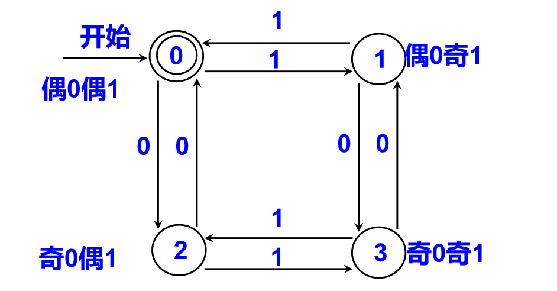
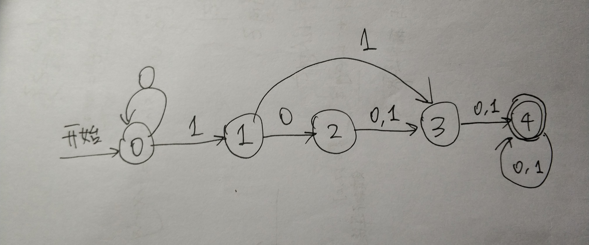

# HW2

### 2.1 e 

>  从下面每种语言的参考手册确定它们形成输入字母表的字符集(不包括那些只可以出现在字符串或注释中的字符)
>
> (e) SQL

**Ans**

**[0-9,a-z,A-Z$_]** 

 **`(`**  **`)`**  **`^`** **`@`**  **`:`**  **`[`**  **`]`**  **`{`**   **`}`**  **`;`**  **`,`**  **`.`**   `'`  `"`   `

**`<`**  **`>`** **`=`**  **`+`** **`-`**  **`/`** **`|`** **`&`**  **`!`**  **`%`**  **`#`** 

not sure: # 注释标志，不属于注释内容，个人认为属于字符集

[Ref]: https://docs.oracle.com/cd/B19306_01/server.102/b14200/toc.htm	""Oracle""


### 2.2

> 在下面的C函数中，按序列出所有的记号，并给每个记号以合理的属性值
>
> ```c
> long gcd(long p, long q) {
>     if (p & q == 0)
>         return q;
>     else
>         return gcd(q, p%q);
> }
> ```

**Ans** 

```
<long> <id, gcd> <(> <long> <id, p> <,> <long> <id,q> <)> <{>
<if> <(> <id, p> <op, &> <id, q> <comparison, EQ> <num, 0>
	<return> <id, q> <;>
<else>
	<return> <id, gcd> <(> <id, q> <,> <id, p> <op, %> <id, q> <;>
<}>
```

PS: 若使用clang编译

```shell
  ~/Downloads > clang -Xclang -dump-tokens gcd.c   
long 'long'	 [StartOfLine]	Loc=<gcd.c:1:1>
identifier 'gcd'	 [LeadingSpace]	Loc=<gcd.c:1:6>
l_paren '('		Loc=<gcd.c:1:9>
long 'long'		Loc=<gcd.c:1:10>
identifier 'p'	 [LeadingSpace]	Loc=<gcd.c:1:15>
comma ','		Loc=<gcd.c:1:16>
long 'long'	 [LeadingSpace]	Loc=<gcd.c:1:18>
identifier 'q'	 [LeadingSpace]	Loc=<gcd.c:1:23>
r_paren ')'		Loc=<gcd.c:1:24>
l_brace '{'	 [LeadingSpace]	Loc=<gcd.c:1:26>
if 'if'	 [StartOfLine] [LeadingSpace]	Loc=<gcd.c:2:5>
l_paren '('	 [LeadingSpace]	Loc=<gcd.c:2:8>
identifier 'p'		Loc=<gcd.c:2:9>
amp '&'	 [LeadingSpace]	Loc=<gcd.c:2:11>
identifier 'q'	 [LeadingSpace]	Loc=<gcd.c:2:13>
equalequal '=='	 [LeadingSpace]	Loc=<gcd.c:2:15>
numeric_constant '0'	 [LeadingSpace]	Loc=<gcd.c:2:18>
r_paren ')'		Loc=<gcd.c:2:19>
return 'return'	 [StartOfLine] [LeadingSpace]	Loc=<gcd.c:3:9>
identifier 'q'	 [LeadingSpace]	Loc=<gcd.c:3:16>
semi ';'		Loc=<gcd.c:3:17>
else 'else'	 [StartOfLine] [LeadingSpace]	Loc=<gcd.c:4:5>
return 'return'	 [StartOfLine] [LeadingSpace]	Loc=<gcd.c:5:9>
identifier 'gcd'	 [LeadingSpace]	Loc=<gcd.c:5:16>
l_paren '('		Loc=<gcd.c:5:19>
identifier 'q'		Loc=<gcd.c:5:20>
comma ','		Loc=<gcd.c:5:21>
identifier 'p'	 [LeadingSpace]	Loc=<gcd.c:5:23>
percent '%'		Loc=<gcd.c:5:24>
identifier 'q'		Loc=<gcd.c:5:25>
r_paren ')'		Loc=<gcd.c:5:26>
semi ';'		Loc=<gcd.c:5:27>
r_brace '}'	 [StartOfLine]	Loc=<gcd.c:6:1>
eof ''		Loc=<gcd.c:6:2>
ld: file too small (length=0) file '/var/folders/mx/zrl06n3x6r3bkhhg0xbkl7cw0000gn/T/gcd-ac39ca.o' for architecture x86_64

```


### 2.3 e

> 叙述由下列正规式描述的语言
>
> （e）（00 | 11) * ((01 | 10) (00 | 11) * (01 | 10) (00 | 11)*)*

**Ans**

接受0和1个数都是偶数的字符串。

- DFA Lec 2 Slides  page51




### 2.4 a, f, i

> 为下列语言写出正规定义
>
> a. 包含5个元音的所以字母串，其中每个元音只出现一次且按顺序排列
>
> f. 由偶数个0和偶数个1构成的所有0和1的串
>
> i. 字母表{a，b}上，a不会相邻出现的所有串

**Ans**

​	**a.**  cset --> [b-dB-Df-hF-Hj-nJ-Np-tP-Tv-zV-Z]

​		cset* (a | A) cset* (e | E) cset* (i | I) cset* (o | O) cset* (u | U) cset* 

​	**f.**  (00 | 11 | (01 | 10) (00 | 11) * (01| 10)) *

​	**i.**   b* (a b b* ) *  (a | ε)

### 2.7 c

> 用算法2.4为下列正规式构造不确定的有限自动机， 给出它们处理输入串ababab的状态转换序列
>
> (c) ((ε | a) b*) *

**Ans**


### 2.11

> 可以从正规式的最简DFA同构来证明两个正规式等价。使用这种技术，证明正规式(a | b)*、(a * | b * ) *和( (ε | a) b *) *等价

**Ans**

三个式子均表示由a,b组成的字符串

最简DFA同构(相同)，因此等价


(a | b)* 从NFA到最简DFA化简过程如下, 另两个式子做法类似, 不再赘述


### 2.15

> 构造一个最简的DFA, 它接受所有大于101的二进制整数

**Ans**

101B = 5D, 即构造大于5的二进制整数

5个状态：

- 0：输入字符串值为0
- 1：输入字符串值为1
- 2：输入字符串值为十进制2
- 3：输入字符串值为十进制3，4，5
- 4：输入字符串值大于十进制5

因为对二进制数来说，往末尾添一个0等于×2，往末尾添一个1等于×2+1. 可以画出DFA




