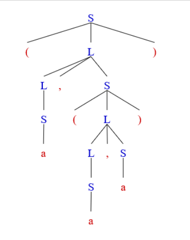
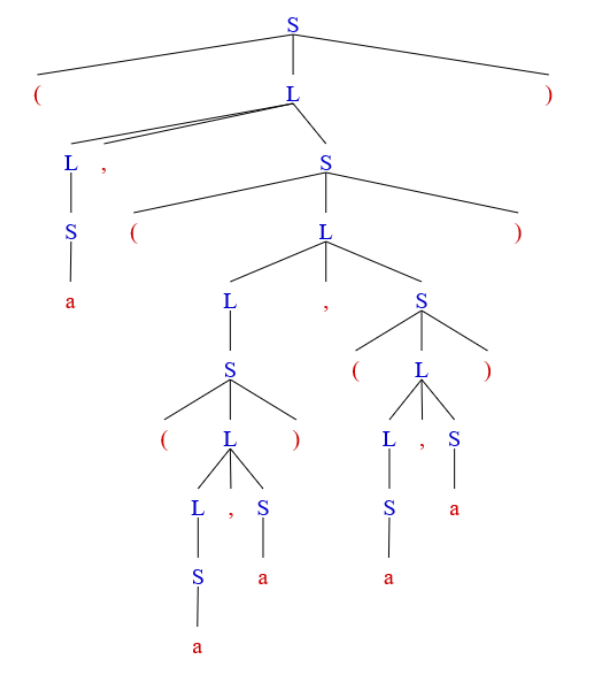

# HW3

#### 3.1 a b

> 考虑文法
>
> ​	S —> (L) | a
>
> ​	L —> L, S | S
>
> (a) 建立句子(a, (a,a))和(a, ((a,a) , (a,a)))的分析树
>
> (b) 为(a)的两个句子构造最左推导

##### (a)

(a, (a,a))



(a, (a,a), (a,a))



##### (b) 

- (a, (a, a))

```
   	S => (L)
		=> (L, S)
		=> (S, S)
		=> (a, S)
		=> (a, (L))
		=> (a, (L, S))
		=> (a, (S, S))
		=> (a, (a, S))
		=> (a, (a, a))
```

- (a, ((a, a), (a, a)))

  ```
  S => (L)
  	=> (L, S) 
  	=> (S, S)
  	=> (a, S)
  	=> (a, (L))
  	=> (a, (L, S))
  	=> (a, (S, S))
  	=> (a, ((L), S))
  	=> (a, ((L, S), S))
  	=> (a, ((S, S), S))
  	=> (a, ((a, S), S))
  	=> (a, ((a, a), S))
  	=> (a, ((a, a), (L)))
  	=> (a, ((a, a), (L, S)))
  	=> (a, ((a, a), (S, S)))
  	=> (a, ((a, a), (a, S)))
  	=> (a, ((a, a), (a, a)))
  ```
  
  

#### 3.6 b c

> 为字母表 ∑ = {a, b} 上的下列每个语言设计一个文法， 其中哪些语言是正规的？
>
> (b) a和b的个数相等的所有串
>
> (c) a和b的个数不相等的所有串

(a) S --> aBS | bAS | ε

​	 A --> aS | bAA

​	 B --> bS | aBB

*(S表示a、b个数相同的串, A表示a比b个数多一个的串, B表示b比a个数多一个的串)*

**不是**正规的

(b) S --> A | B

​	 A --> A' A | A'

​	 B --> B' B | B'

​	S' --> aB'S' | bA'S' | ε

​	 A' --> aS' | bA'A'

​	 B' --> bS' | aB'B'

*(S表示ab个数不相同的串, A表示a比b个数多的串, B表示b比a个数多的串, S'表示ab个数相同的串, A'表示a比b多一个的串,B'表示b比a个数多一个的串)*

**不是**正规的

#### 3.8

> (a) 消除习题3.1文法的左递归
>
> (b) 为(a)的文法构造预测分析器

(a) 

```
- 3.1
	S —> (L) | a
	L —> L, S | S
- 消除左递归
	S -> (L) | a
	L -> SL'
	L' -> ,SL' | ε
```

(b) 

- 预测分析器（隐式递归调用）

```c
void match(termianl t) {
	if (lookedahead == t) lookedahead = nextToken();
    else error();
}
void S() {
    if (lookedahead == '(') {match('('); L(); match(')');}
    else if (lookedahead == 'a') match('a');
    else error();
}
void L() {
    if (lookedahead == '(' || lookedahead == 'a') {S(); Lp();}
    else error();
}
void Lp() {
    if (lookedahead == ',') {match(','); S(); Lp();}
    else error();
}
```

- 非递归的预测分析

FIRST(S) = { (, a }

FIRST(L) = FIRST(S) = { (, a}

FIRST(L') = {`,` ,  ε }

FOLLOW(L) = { ) }

FOLLOW(S) = { $, `,` , ) }

FOLLOW(L') = { ) }

| 非终结符\输入符号 |     (     |    )     |     a     |     `,`     |  $   |
| :---------------: | :-------: | :------: | :-------: | :---------: | :--: |
|         S         | S--> (L)  |          |  S --> a  |             |      |
|         L         | L --> SL' |          | L --> SL' |             |      |
|        L‘         |           | L' --> ε |           | L' --> ,SL' |      |

再用书本p59页的递归分析程序即可


#### 3.10 

> 构造下面文法的LL(1)分析表
>
> ​	D --> TL
>
> ​	T --> **int** | **real**
>
> ​	L --> **id** R
>
> ​	R --> , **id** R | ε

​	FIRST(D) = FIRST(T) = { **int**, **real**}

​	FIRST(L) = {**id**}

​	FIRST(R) = { `,` , ε }

​	FOLLOW(D) = { $ };

​	FOLLOW(T) = {**id**}

​	FOLLOW(L) = FOLLOW(D) = { $ }

​	FOLLOW(R) = FOLLOW(L) = { $ }

| 非终结符 \ 输入符号 |      int      |      real      |       id       |       `,`       |    $    |
| :-----------------: | :-----------: | :------------: | :------------: | :-------------: | :-----: |
|          D          |   D --> TL    |    D --> TL    |                |                 |         |
|          T          | T --> **int** | T --> **real** |                |                 |         |
|          L          |               |                | L --> **id** R |                 |         |
|          R          |               |                |                | R --> ,**id** R | R --> ε |


#### 3.11

> 构造下面文法的LL(1)分析表
>
> ​	S --> aBS | bAS | ε
>
> ​	A --> bAA | a
>
> ​	B --> aBB | b

​    FIRST(S) = { a, b, ε }

​	FIRST(A) = { b, a }

​	FIRST(B) = { a, b }

​	FOLLOW(S) = { $ }

​	FOLLOW(A) = { a, b, $ }

​	FOLLOW(B) = { a, b, $ }

| 非终结符\输入符号 |     a     |     b     |    $    |
| :---------------: | :-------: | :-------: | :-----: |
|         S         | S --> aBS | S --> bAS | S --> ε |
|         A         |  A --> a  | A --> bAA |         |
|         B         | B --> aBB |  B --> b  |         |


#### 3.12

> 下面的文法是否为LL(1)文法， 说明理由
>
> ​	S --> AB | PQx  		A --> xy			B --> bc
>
> ​	P --> dP | ε				Q --> aQ | ε

​	FIRST(AB) = { x }

​	FIRST(PQx) = {d, a, x}

  因为FIRST(AB)  ∩ FIRST(PQx) = {x}不为空, 所以上述文法不是LL(1)文法