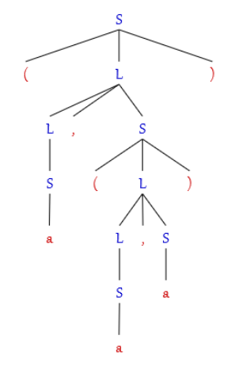
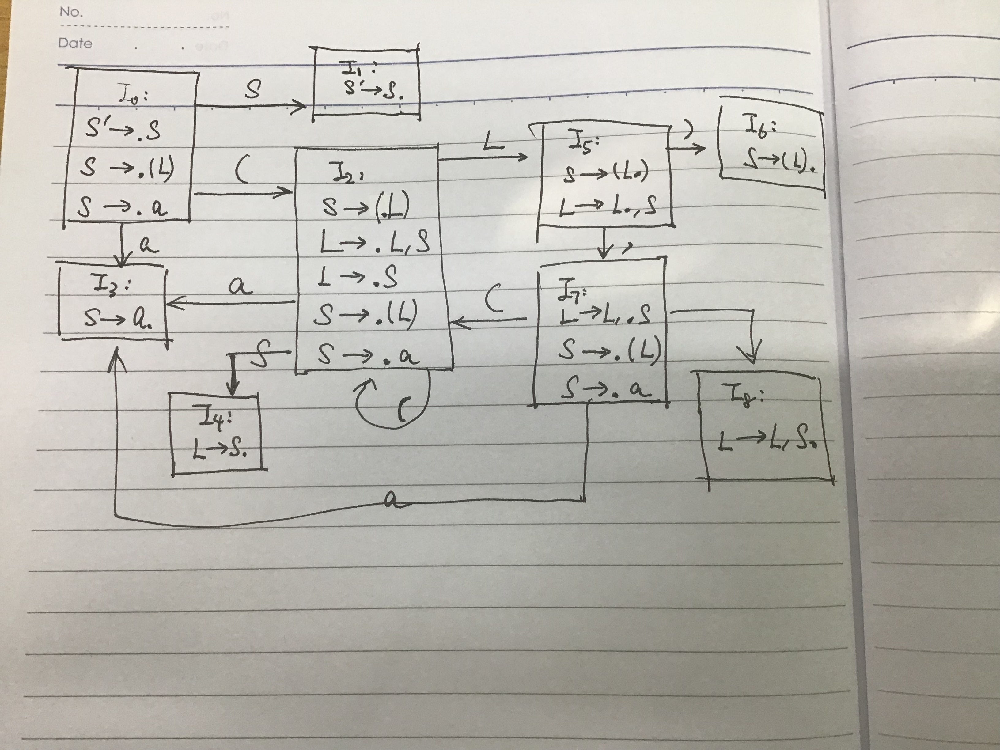
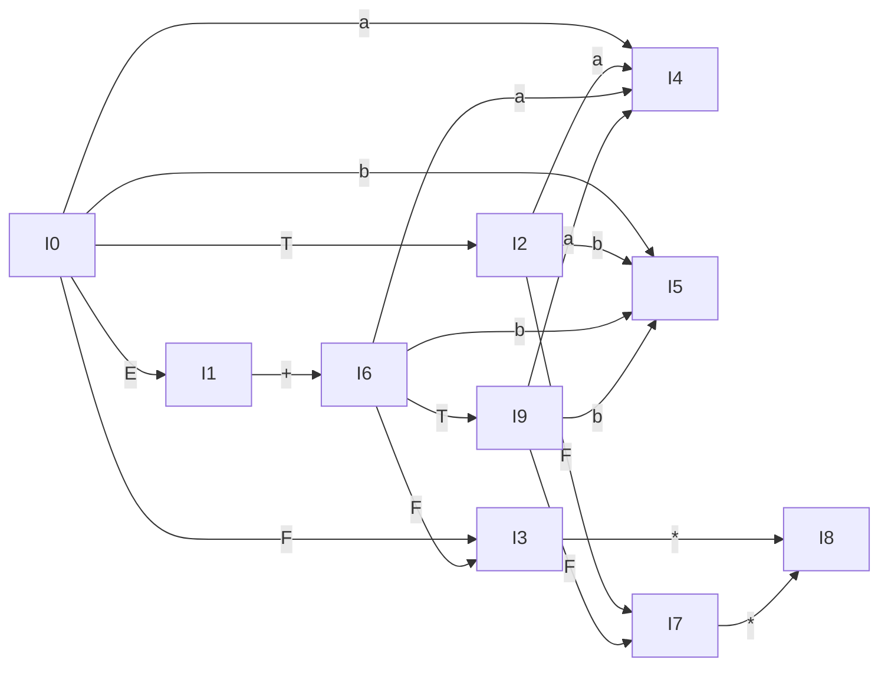
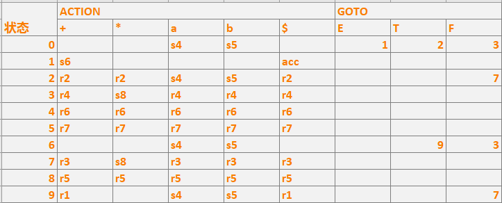
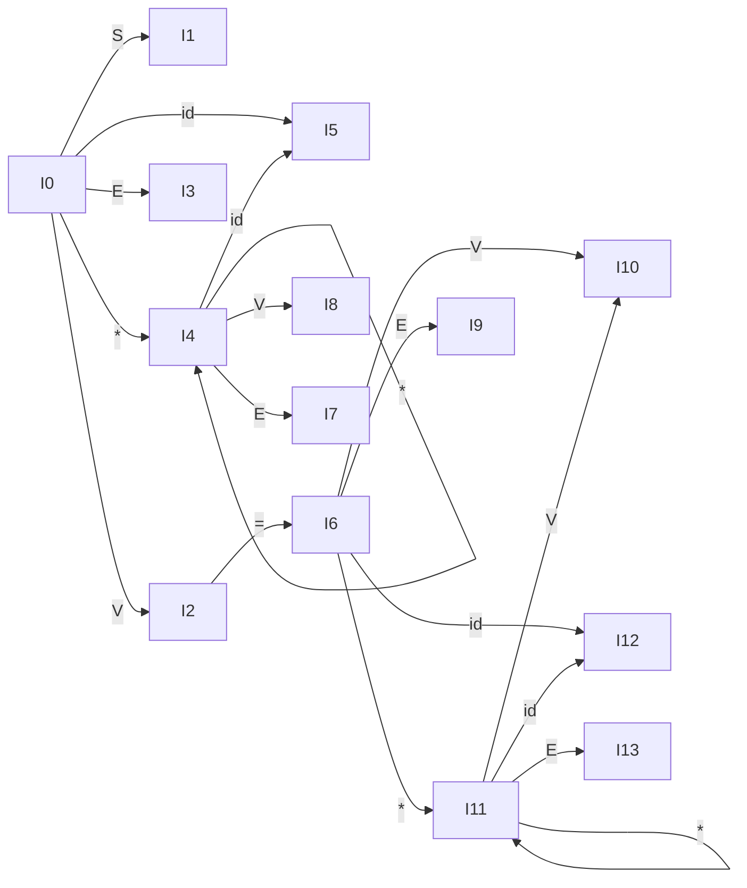

## HW4

#### 3.16

> (a) 用习题3.1的文法构造(a, （a, a))的最右推导， 说出每个右句型的句柄。
>
> (b) 给出对应(a)的最右推导的移进-归约分析器的步骤。
>
> (c) 对照(b)的移进-归约，给出自下而上构造分析树的步骤。

(a) S => <u>**(L)**</u>
	=> (<u>**L, S**</u>)
	=> (L, **<u>(L)</u>**)
	=> (L, (<u>**L, S**</u>))
	=> (L, (L, **<u>a</u>**))
	=> (L, (**<u>S</u>**, a))
	=> (L, (**<u>a</u>**, a))
	=> (**<u>S</u>**, (a, a))
	=> (**<u>a</u>**, (a, a))

**加粗**&<u>下划线</u>的是句柄

(b) 移进-归约分析器

|     栈      |     输入     |        动作        |
| :---------: | :----------: | :----------------: |
|      $      | (a, (a, a))$ |        移进        |
|     $(      | a, (a, a))$  |        移进        |
|   $(**a**   |  , (a, a))$  | 按 S --> **a** 归约 |
|   $(**S**   |  , (a, a))$  |        按 L --> **S**归约        |
| $(L | , (a, a))$ | 移进 |
|    $(L,     |   (a, a))$   |        移进        |
|   $(L, (    |   a, a))$    |        移进        |
| $(L, (**a** |    , a))$    | 按 S -> **a** 归约 |
|   $(L, (**S**   |    , a))$    | 按 L --> **S**归约 |
| $(L, (L | , a))$ | 移进 |
| $(L, (L, | a))$ | 移进 |
| $(L, (L, **a** | ))$ | 按 S --> **a** 归约 |
| $(L, (**L, S** | ))$ | 按 L --> **L, S **归约 |
| $(L, (L | ))$ | 移进 |
| $(L, **(L)** | )$ | 按 S --> **(L)** 归约 |
| $(**L, S** | )$ | 按 L --> **L, S **归约 |
| $(L | )$ | 移进 |
| $**(L)** | $ | 按 S --> **(L)** 归约 |
| $S | $ | 接受 |

（c) 构造分析树

步骤：

输入串：`(a, (a, a))`

`(a`						(读入`(a`)

`(S`						(归约)

`(L`						(归约)

`(L,(a` 				 (再读入`,(a`)

`(L,(S`				  (归约)

`(L,(L`			 	 (归约)

`(L,(L,a`			  (再读入`,a`)

`(L,(L,S`			  (归约)

`(L,(L`			 	 (归约)

`(L,(L)`				(再读入`(`)

`(L, S`				  (归约)

`(L`						(归约)

`(L)`					  (再读入`)`)

`S` 						 (归约)



`[S [(] [L [L [S [a]]] [,] [S [(] [L [L [S [a]]] [,] [S [a]]] [)]]] [)]]`

#### 3.17

> 给出接受文法
>
> ```
> S --> (L)  | a    
> L --> L, S | S
> ```
>
> 的活前缀的一个DFA.

拓广文法

```
S' --> S    
S --> (L) | a
L --> L, S | S
```

DFA:



#### 3.19 A

> 考虑下面的文法：
>
> ```
> E --> E + T | T
> T --> TF | F
> F --> F* | a | b
> ```
>
> (a) 为此文法构造SLR分析表

```
I0:
E' -> .E
E -> .E + T
E -> .T
T -> .TF
T -> .F
F -> .F*
F -> .a
F -> .b

I1:
E' -> E.
E -> E. + T

I2:
E -> T.
T -> T.F
F -> .F*
F -> .a
F -> .b

I3: 
T -> F.
F -> F.*

I4:
F -> a.

I5:
F -> b.

I6:
E -> E +. T
T -> .TF
T -> .F
F -> .F*
F -> .a
F -> .b

I7:
T -> TF.
F -> F.*

I8:
F -> F*.

I9:
E -> E + T.
T -> T.F
F -> .F*
F -> .a
F -> .b


```



SLR分析表：

```
产生式编号：
 1 E -> E + T
 2 E -> T
 3 T -> TF
 4 T -> F
 5 F -> F*
 6 F -> a
 7 F -> b
 
 Follow(E) = {+, $}
 Follow(T) = {+, a, b, $}
 Follow(F) = {+, *, a, b, $}
```




#### 3. 21 a

> (a) 证明下面文法：
>
> ```
> S --> AaAb | BbBa
> 
> A --> ε
> 
> B --> ε
> ```
>
> 是LL(1)文法，但不是SLR(1)文法

1. 因为仅终极符S有两个不同的选择，因此只需考察它的两个右部。由于

`FIRST(AaAb) = {a}`, `FIRST(BbBa) = {b}`它们的交集为空，所以该文法是LL(1)文法。

2. 根据该文法， 不论对什么句子，在面临第一个符号时进行空归约。由于FOLLOW(A)和FOLLOW(B)都等于{a, b}, 那么就不能确定是把ε归约成A还是归约成B,因此出现归约-归约冲突，所以该文法不是SLR(1)的。

#### 3.25

> 一个非LR(1)文法如下：
>
> ```
> L -> MLb | a
> M -> ε
> ```
>
> 请给出所有含移进-归约冲突的规范LR(1)项目集，以说明该文法确实不是LR(1)的

拓广文法：

```
L' -> L
L -> MLb | a
M -> ε
```

项目集：

```
I0:
L' -> .L, $
L -> .MLb, $
L -> .a, $
M -> ., $

I1:
L' -> L., $

I2:
L -> M.Lb, $
L -> .MLb, b
L -> .a, b
M -> ., a

I3:
L -> a., $
 
I4:
L ->ML.b, $

I5:
L -> M.Lb, b
L -> .MLb, b
L -> .MLb, b
M -> ., a

I6:
L -> a., b

I7:
L -> MLb., $

I8:
L -> ML.b, b

I9:
L -> MLb., b
```

含移进-归约冲突的规范项目集为`I0`,`I2`,`I5`

分析器在面临a，未读入一个符号的情况下要做若干次ε归约， ε归约的次数和a后面的b的个数一致。但是分析器在只向前看到第一个符号的情况下，是不可能知道后面有多少个b的，因此为读入任何符号时就出现移进-归约冲突。不是LR(1)的。

#### 3.27

> 文法G的产生式如下：
>
> ```
> S -> I | R
> I -> d | Id
> R -> WpF
> W -> Wd | ε
> F -> Fd | d
> ```
>
> (a) 令d表示任意数字，p表示十进制小数点，那么终结符S,I,R,W和F在编程语言中分别表示什么？
>
> (b) 该文法是LR(1)文法吗？为什么？

(a) **S**:无符号数 **I**：无符号整数 **R**：无符号实数 **W**: 无符号实数的小数点前面部分 **F**：无符号实数的小数点后面部分

(b) 不是LR(1)文法，当第一个终结符是**d**时，不知道该把**d**归约成**I**还是空归约成**W**

#### 3.29

> (a) 为下面的文法构造LR(1)分析表，画出像图3.20这样的状态图就可以
>
> ```
> S -> V = E|E
> V -> *E | id
> E -> V
> ```
>
> (b) 上述状态转换图有同心项目集吗？若有，合并同心项目集后是否会出现动作冲突？

```
I0:
S' -> .S, $
S -> .V = E, $
S -> .E, $
V -> .*E, =/$
V -> .id, =/$
E -> .V, $

I1:
S' -> S., $

I2:
S -> V.=E, $
E -> V., $

I3:
S -> E., $

I4:
V -> * .E, =/$
E -> .V, =/$
V -> .*E, =/$
v -> .id, =/$

I5:
V -> id., =/$

I6:
S ->V = .E, $
E -> .V, $
V -> .*E, $
V -> .id，$

I7:
V -> *E., =/$

I8:
E -> V., =/$

I9:
S -> V = E., $

I10:
E -> V., $

I11:
V -> *.E, $
E -> .V, $
V -> .*E, $
V -> .id, $

I12:
V -> id., $

I13:
V -> *E., $

```



(2) 合并同心项目集(`I4` 和`I11` , `I5`和 `I12` , `I7`和 `I13`, `I8`和 `I10`)后没有动作冲突。

#### 3.30

> 描述文法
>
> ```
> S -> aSbS | aS | ε
> ```
>
> 产生的语言，并为此语言写一个LR(1) 文法

L = { w | w ∈ (a | b) * 并且在w的任何前缀中，a的个数不少于b的个数}

该语言的一个LR(1) 文法是

```
S -> aS | aYbS | ε
Y -> aYbY | ε
```

