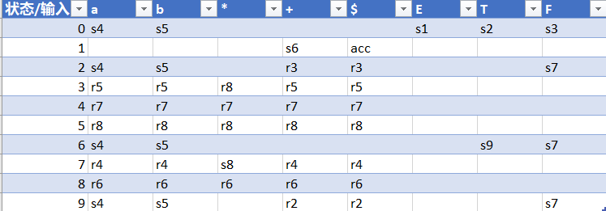
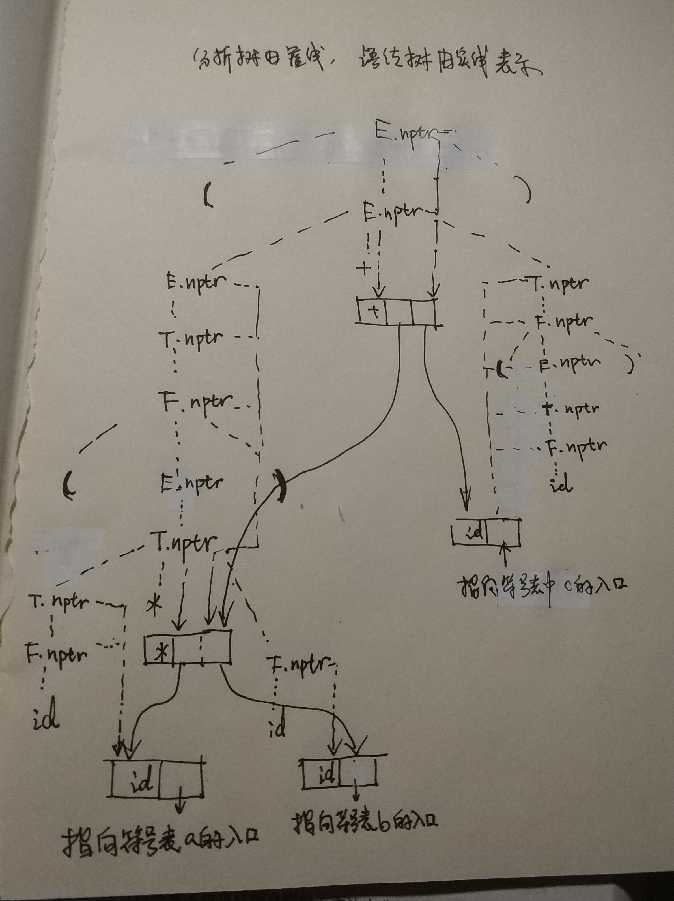

# HW6

#### 3.19 b

> 考虑下面的文法：
>
> ```
> E --> E + T | T
> T --> TF | F
> F --> F* | a | b
> ```
>
> (a) 构造LALR分析表
> 



#### 3.24

> 证明下面文法
>
> ```
> S -> Aa | bAc | Bc | bBa
> A -> d
> B -> d
> ```
>
> 是LR(1)文法，但不是LALR(1)文法

该文法产生的语言仅含四个句子：da, bdc, dc和bda. 在LR(1)情况下，可以很容易的看出d什么情况下归约成A，什么时候归约成B, 所以是LR(1)文法。

在该文法的规范LR(1)项目集的集合中，对活前缀d有效的项目集是

`{[A -> d . , a], [B -> d . , c]}`

对活前缀bd有效的项目集是

`{[A -> d . , c], [B -> d . , a]}`

这两个集合都不含冲突，合并同心项目集后变成

`{[A -> d . , a/c], [B -> d . , a/c]}`

出现归约-归约冲突，所以不是LALR(1)文法。


#### 3.27

> HAVE DONE IN HW4/5


#### 4.2 a

> 构造表达式((a*b) + (c))的分析树和语法树：
>
> (a) 根据表4.3的语法制导定义



#### 4.3

> 为文法
>
> ```
> S -> (L) | a
> L -> L, S | S
> ```
>
> (a) 写一个语法制导定义，它输出括号的对数
>
> (b) 写一个语法制导定义，它输出括号嵌套的最大深度

(a) 拓广文法，加上新的开始符号S' 和新的产生式S' -> S . 输出括号对数的语法制导定义如下:

​	S' -> S			print (S.num)

​	S -> (L)		  S.num = L.num + 1

​	S -> a			S.num = 0;

​	L -> L1, S   	L.num = L.num + S.num

​	L -> S			 L.num = S.num

(b) 拓广文法

​	S' -> S			print (S.num)

​	S -> (L) 		  S.max = L.max + 1

​	S -> a			S.max = 0

​	L -> L1, S	   L.max = if (L1.max > S.max) L1.max else S.max

​	L -> S			 L.max = S.max

​		

#### 4.5

> 为下面文法写一个语法制导的定义， 它完成一个句子的while-do最大嵌套层次的计算并输出这个计算结果
>
> ```
> S -> E
> E -> while E do E | id := E | E + E | id | (E)
> ```

​	S -> E								print (S.loop)

​	E -> **while** E1 **do** E2     	E.loop = max (E1.loop, E2.loop) + 1

​	E -> **id** := E						E.loop = E1.loop

​	E -> E1 + E2					  E.loop = max (E1.loop, E2.loop)

​	E -> **id**								E.loop = 0

​	E -> (E1)							 E.loop = E1.loop


#### 例题3

> 为下面文法写一个语法制导的定义，给出文法中S产生的二进制数的值，例如输入101.101时，S.val = 5.625
>
> ```
> S -> L.R | L
> L -> L B | B
> R -> B R| B
> B -> 0 | 1
> ```

 令B的综合属性为c， 表示由B产生的那一位的贡献

 i是B的继承属性，val和c是综合属性

 语法制导定义如下：

 ```
 S -> L.R			S.val = L.val + R.val
 S -> L				S.val = L.val
 L -> BL1			B.i = L1.c × 2; L.c = L1.c × 2; L.val = L1.val + B.c
 L -> B				B.i = 1; L.c = 1; L.val = B.c
 R -> R1B			B.i = R1.c/2; R.c = R1.c/2; R.val = R1.val + B.c
 R -> B				B.i = 0.5; R.c = 0.5; R.val = B.c
 B -> 0				B.c = 0
 B -> 1				B.c = B.i
 ```

 