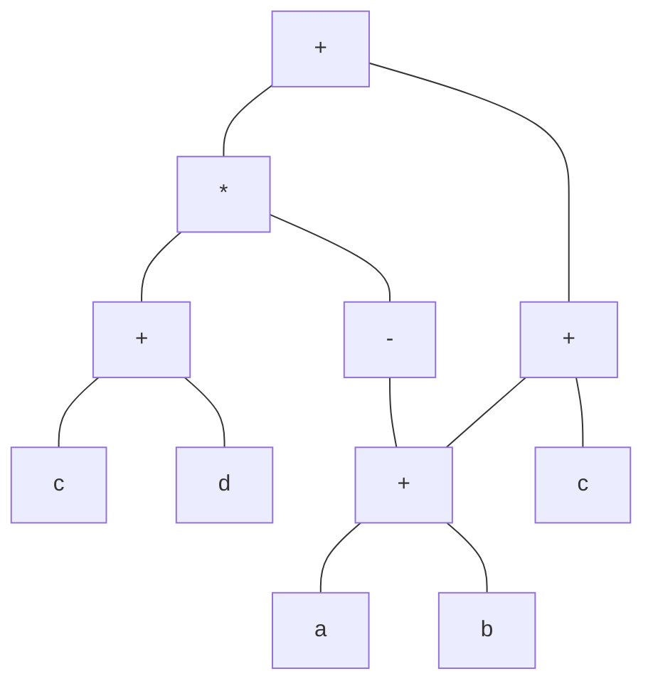
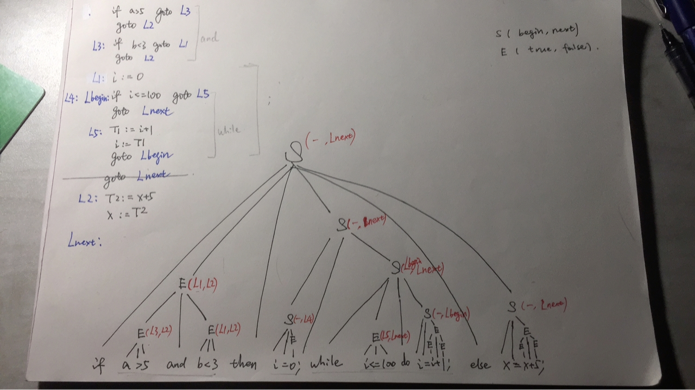

## HW8

#### 7.1 b d

> 把算术表达式 `-(a+b) * (c+d) + (a+b+c) 翻译成：
>
> (b) 有向无环图
>
> (d) 三地址代码

（b) 



(d) 

```
三地址代码：
	t1=a+b
	t2=-t1
	t3=c+d
	t4=t2*t3
	t5=a+b
	t6=t5+c
	t7=t4+t6
```


#### lecture11-slides p60

> 结合中间代码语法制导定义，为下面的高级语言代码生成符号标号的中间代码
>
> 假设所有的变量都已经提前定义，信息存在符号表内，可通过lookup 查询
>
> ```
> if (a > 5 and b < 3) then
> 	i = 0;
> 	while (i <= 100) do
> 		i = i + 1;
> else
> 	x = x + 5;
> 	
> ```

**ANS**



```
	if a > 5 goto L3
	goto L2
L3: if b < 3 goto L1
	goto L2
L1: i := 0
L4:
Lb: if i <= 100 goto L5
	goto Lnext
L5: T1 := i + 1
	i := T1
	goto Lb
	//goto Lnext 这行跟在while后永远不执行
L2: T2 := x + 5
	x := T2
Lnext:
```

