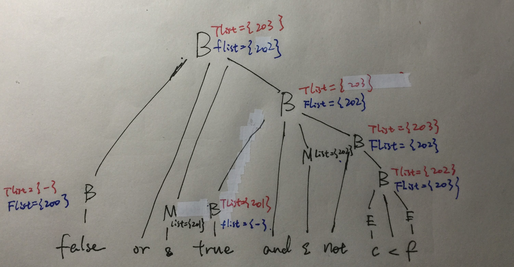

# HW9

##### 考虑布尔表达式`false or true and not c < f`

   参考本ppt 中布尔表达式短路计算、标号回填等翻译技术，生成对应的三地址代码,  假设`nextinstr = 200`. 除了三地址代码外，画出LR 分析方法对应的注释分析树，标注出属性和属性值

​	结合LR 分析方法指出回填的具体细节:

- 在使用哪一个产生式归约时候进行的回填
- 用哪一个标号，回填了哪一个不完整的g oto 指令

**ANS**

三地址代码：

```
(200) goto 201 //201回填(200)
(201) goto 202 //202回填(201)
(202) if c < f goto -
(203) goto -
```

注释分析树：



回填细节：

1. 使用`B -> B1 and M B2`归约时，将`M.instr`也就是202填入`B1.truelist`也就是`(201)`目标区段
2. 使用`B -> B1 or M B2`归约时，将`M.instr`也就是201填入`B1.falselist`也就是`(200)`目标区段