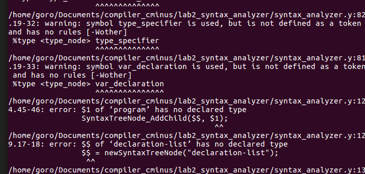

## lab2实验报告

姓名 吴舜钰

学号 PB17071401

### 实验要求

先根据新的实验框架重整lab1，利用cmake管理源代码。

再利用Bison工具对C minus文件flex词法分析的结果进行语法分析，生存语法树并打印输出。

### 实验设计

1. 给`%union`增加`struct _SyntaxTreeNode *`域

   ```c
   %union {
   		//SyntaxTreeNode * type_node;
   		struct _SyntaxTreeNode * type_node;//issues #80
   }
   ```

   在lexical_analyzer.l中，设置'readyylval()'和'readnumyylval()'将读入的终结符转为`SyntaxTreeNode`类型，从而可以在syntax_analyzer.y中使用。所有的非终结符也设为`%type <type_node>`

   ```c
   void readyylval() {
   	#ifndef LAB1_ONLY
   	yylval.type_node = newSyntaxTreeNode(yytext);
   	#endif
   }
   
   void readnumyylval() {
   	#ifndef LAB1_ONLY
   	yylval.type_node = newSyntaxTreeNodeFromNum(atoi(yytext));
   	#endif
   }
   //flex actions like these
   \+          { readyylval(); return ADD; }
   {NUM}       { readnumyylval(); return NUMBER; }
   ```

   这里使用#ifndef LAB1_ONLY macro简化使用，不需要写多个文件来应对不同lab。

   在执行lab2时，readyylval和readnumyylval都为空函数。

2. 将.l文件中关于lines的部分从analyzer移动到了action。主要涉及`\n`, `\r`, `comment`的更改。从而能够输出syntax error所在行。

   ```c
   \n          {  
   				lines++; 
   				#ifdef LAB1_ONLY
   					return EOL;
   				#endif
   			}
   \r 			{  
   				lines++;
   				#ifdef LAB1_ONLY
   					return EOL;
   				#endif
   			}
   .           { return ERROR;}
   \/\*        {   //cmFlag is the state varible, handle all kinds of comments
                   cmFlag = 0;
                   pos_end += strlen(yytext);
                   char c;
                   do {
                       c = input();
                       pos_end++;
                       if (c == '\n') {
                           pos_end = 1;
                           lines++;
                       }
                       if (cmFlag == 0 && c == '*') cmFlag = 1;
                       else if (cmFlag == 1 && c == '*') cmFlag = 1;
                       else if (cmFlag == 1 && c == '/') cmFlag = 2;
                       else cmFlag = 0;
                   } while (cmFlag != 2);
                   #ifdef LAB1_ONLY
   					return COMMENT;
   				#endif
               }
   ```

   3. 如上代码所示，给`[ \t]`, `\n`, `\r`, `comment`的return操作加上宏，只在lab1编译，语法分析时忽略空白换行和注释。
   4.  关于二义性和冲突处理

   > 　Bison的一个非常好用同时也是一个非常恼人的特性，是即使对于一个有二义性的文法，它也会有自己的一套隐式的冲突解决方案（我们知道，一旦出现归约/归约冲突，Bison总会选择靠前的产生式；而一旦出现移入/规约冲突，则Bison总会选择移入）从而生成相应的语法分析器，而这些冲突解决方案在某些场合有可能并不是我们所期望的。

   解决方案： 考虑优先级和结合性，利用`%left`, `%right`, `%nonassoc`对终结符的结合性进行规定，同时，排在后面的算符优先级高于排在前面的算符。

   Bison的每一条产生式后面都可以紧跟一个`%prec`标记，指明该产生式的优先级等同于一个终结符。

   - 对运算符号

   ```bison
   %right ASSIN
   %left ADD SUB
   %left MUL DIV
   ```

   - 对悬空的else文法 

   ```bison
   …
   
   %nonassoc	LOWER_THAN_ELSE
   
   %nonassoc	ELSE
   
   …
   
   %%
   
   …
   
   selection_stmt: IF LPARENTHESE expression RPARENTHESE statement %prec LOWER_THAN_ELSE 
   	| IF LPARENTHESE expression RPARENTHESE statement ELSE  statement 
   ;
   ```

   通过定义一个比ELSE优先级更低的LOWER_THAN_ELSE，降低了规约相对于移入ELSE的优先级：

### 实验结果

1、选择样例lab2_expression-assign.cminus

- 样例内容 (46bytes)

```c
int main(void)
{
	a = b = c + d;
	return 0;
}
```

- 输出结果(2.2kB)

```
>--+ program
|  >--+ declaration-list
|  |  >--+ declaration
|  |  |  >--+ fun-declaration
|  |  |  |  >--+ type-specifier
|  |  |  |  |  >--* int
|  |  |  |  >--* main
|  |  |  |  >--* (
|  |  |  |  >--+ params
|  |  |  |  |  >--* void
|  |  |  |  >--* )
|  |  |  |  >--+ compound-stmt
|  |  |  |  |  >--* {
|  |  |  |  |  >--+ local-declarations
|  |  |  |  |  |  >--* epsilon
|  |  |  |  |  >--+ statement-list
|  |  |  |  |  |  >--+ statement-list
|  |  |  |  |  |  |  >--+ statement-list
|  |  |  |  |  |  |  |  >--* epsilon
|  |  |  |  |  |  |  >--+ statement
|  |  |  |  |  |  |  |  >--+ expression-stmt
|  |  |  |  |  |  |  |  |  >--+ expression
|  |  |  |  |  |  |  |  |  |  >--+ var
|  |  |  |  |  |  |  |  |  |  |  >--* a
|  |  |  |  |  |  |  |  |  |  >--* =
|  |  |  |  |  |  |  |  |  |  >--+ expression
|  |  |  |  |  |  |  |  |  |  |  >--+ var
|  |  |  |  |  |  |  |  |  |  |  |  >--* b
|  |  |  |  |  |  |  |  |  |  |  >--* =
|  |  |  |  |  |  |  |  |  |  |  >--+ expression
|  |  |  |  |  |  |  |  |  |  |  |  >--+ simple-expression
|  |  |  |  |  |  |  |  |  |  |  |  |  >--+ additive-expression
|  |  |  |  |  |  |  |  |  |  |  |  |  |  >--+ additive-expression
|  |  |  |  |  |  |  |  |  |  |  |  |  |  |  >--+ term
|  |  |  |  |  |  |  |  |  |  |  |  |  |  |  |  >--+ factor
|  |  |  |  |  |  |  |  |  |  |  |  |  |  |  |  |  >--+ var
|  |  |  |  |  |  |  |  |  |  |  |  |  |  |  |  |  |  >--* c
|  |  |  |  |  |  |  |  |  |  |  |  |  |  >--+ addop
|  |  |  |  |  |  |  |  |  |  |  |  |  |  |  >--* +
|  |  |  |  |  |  |  |  |  |  |  |  |  |  >--+ term
|  |  |  |  |  |  |  |  |  |  |  |  |  |  |  >--+ factor
|  |  |  |  |  |  |  |  |  |  |  |  |  |  |  |  >--+ var
|  |  |  |  |  |  |  |  |  |  |  |  |  |  |  |  |  >--* d
|  |  |  |  |  |  |  |  |  >--* ;
|  |  |  |  |  |  >--+ statement
|  |  |  |  |  |  |  >--+ return-stmt
|  |  |  |  |  |  |  |  >--* return
|  |  |  |  |  |  |  |  >--+ expression
|  |  |  |  |  |  |  |  |  >--+ simple-expression
|  |  |  |  |  |  |  |  |  |  >--+ additive-expression
|  |  |  |  |  |  |  |  |  |  |  >--+ term
|  |  |  |  |  |  |  |  |  |  |  |  >--+ factor
|  |  |  |  |  |  |  |  |  |  |  |  |  >--* 0
|  |  |  |  |  |  |  |  >--* ;
|  |  |  |  |  >--* }
```


2、先由flex得到词法单元tokens，其中用到了`yylex()`

​	然后由bison通过函数`yyparse()`对词法单元进行词法分析

- 函数调用先后次序：

  `syntax_main`->`getAllTestcase`->`syntax`->`newSyntaxTree`->`yyrestart`->`yylex`->`yyparse`->(including a bunch of `newSyntaxTreeNode` and `SyntaxTreeNode_AddChild`)->`deleteSyntaxTree`

  忽略字符串处理，文件操作，printf等函数。这里没有用到`yyerror`

- 用到的产生式

  - program → declaration-list
  - declaration-list →  declaration
  - declaration →  fun-declaration
  - fun-declaration → type-specifier `ID` `(`params`)` compound-stmt
  - program → declaration-list
  - declaration-list →  declaration
  - declaration →  fun-declaration
  - fun-declaration → type-specifier `ID` `(`params`)` compound-stmt
  - type-specifier → `int`
  - params →  `void`
  - compound-stmt → `{` local-declarations statement-list `}`
  - local-declarations → empty
  - statement-list → statement-list statement
  - statement-list →  empty
  - statement → expression-stmt 
  - expression-stmt → expression ;
  - expression → var `=` expression
  - var → `ID`
  - expression → simple-expression
  - simple-expression →  additive-expression
  - additive-expression → additive-expression addop term 
  - additive-expression →  term
  - term →  factor
  - factor →  var 
  - statement → return-stmt
  - `return` expression ;
  - factor →  `NUM`

### 实验难点

1. merge后重建lab1框架出现了很多冲突。

2. 不理解头文件中一些变量的意思，比如`extern int fileno (FILE *__stream) __THROW __wur;`, `const char * strtoken(Token t);`最后并没有用到。

3. 移进归约冲突的解决写在了#实验设计的4

4. 一些玄学问题及解决

   - 最初不知道写`%token <type_node> ADD`后要把enum值也带上，同学提醒
   - 看助教的tutor没意识到非终结符也需要声明，补上`%type <type_node> progrm`
   - ./build/test_syntax一直报`syntax error for int`, `syntax error for   ` , ``syntax error for /*`怎么改都没效果. 然后发现一直没有再次make -C build/ ，始终拿最初的make结果在测试。。
   - 意识到要make之后（这时还没有意识到要%type），纠结了一段时间之后被同学提醒.
   - 重新加%type的时候脑子可能被狗吃了用了不同的`_`，而之前的产生式里全是`-`，然后报了一堆

   

   ​		看了很久才发现不对。

   - ```c
     	SyntaxTreeNode * type_node
     ```

     在syntax_analyzer.y中识别不出来的问题，翻ISSUE#80解决, 改为

     ```c
     	struct _SyntaxTreeNode * type_node;//issues #80
     ```

   - commc.c中相对路径的问题，翻issue

   - yylval的使用，翻document


### 实验总结

1. 实际处理了merge conflict
2. 重新熟悉c语言结构体
3. 简单了解cmake和makefile
4. 简单了解bison语法
5. 不同文件间变量共享，`extern`
6. 培养耐心。。。

### 实验反馈

希望tutor（如bison的）能再稍微详细一点，我身边一堆人都不知道token要把数字带上的

希望以后更多的是增量式的修改

关于工作量的意见好像没什么用就不提了hhh，不过最好书面作业ddl和lab ddl不要撞到一起（这个应该有希望满足？）


