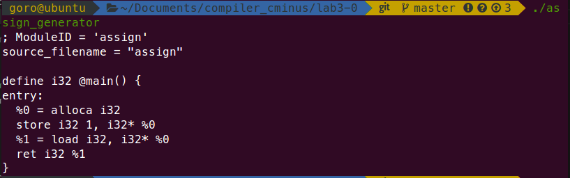
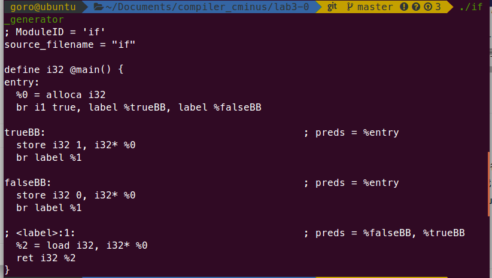
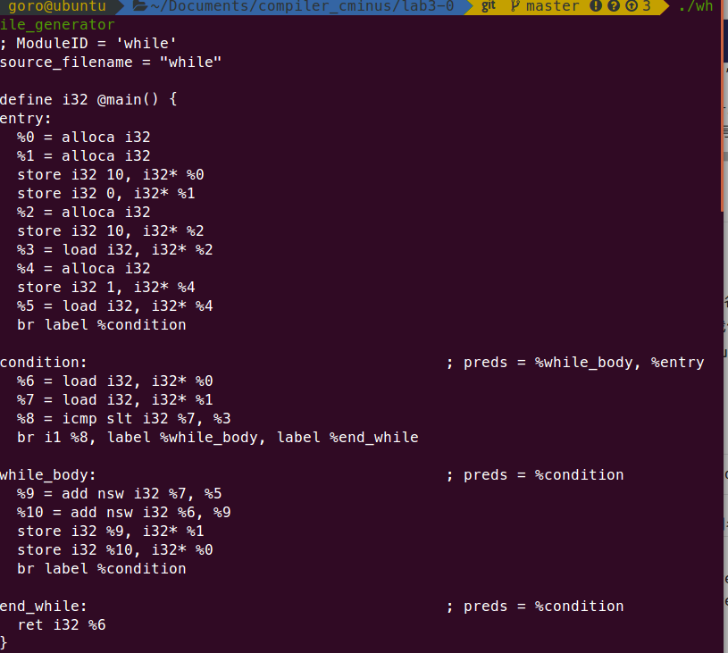
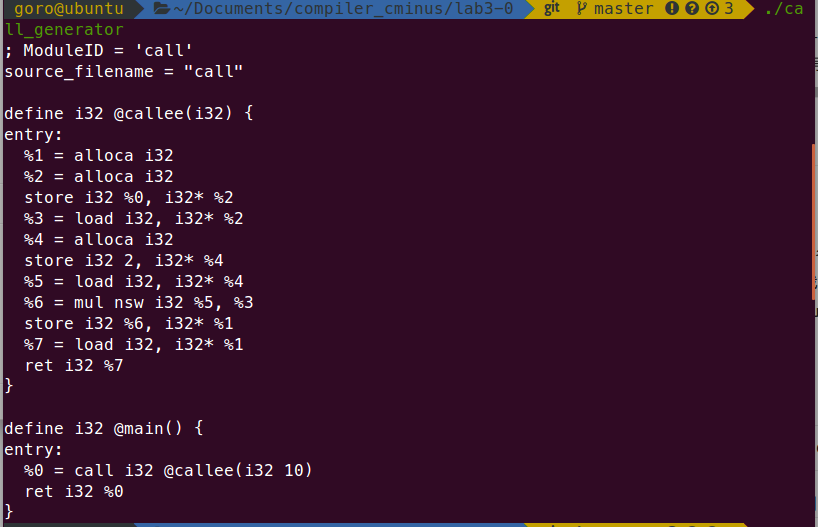
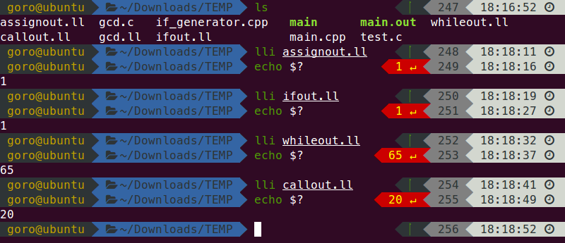

## lab3-0实验报告

姓名 吴舜钰

学号 PB17071401

### 实验要求

根据ppt和官方文档简单了解LLVM IR。阅读机器生成的.ll文件，理解逻辑后手工翻译提供的四个c例子。阅读助教写的cpp机器翻译程序，理解并编写自己的四个cpp机器翻译程序。

### 实验结果

##### 1 assign

程序过于简单，只设一个mainbb

```c++
	builder.SetInsertPoint(mainbb);
    auto aAlloca = builder.CreateAlloca(TYPE32);    // 参数a的空间分配
    builder.CreateStore(CONST(1), aAlloca);         // 存入常数1
    auto aLoad = builder.CreateLoad(aAlloca);       // 将参数a load上来
    builder.CreateRet(aLoad);                       // 返回a
```

对应

```c
  int a;
  a = 1;
  return a;
```

**输出**




##### 2 if

四个BasicBlock：ifBB, trueBB, falseBB, retBB

其中ifBB只是一些预处理，true对应if语句true分支，falseBB对应if语句false分支，retBB处理返回值

条件分支：

```c++
	auto icmp = builder.CreateICmpSGT(CONST(2), CONST(1));  // 2 AND 1 COMPARE,注意SGT
    auto br = builder.CreateCondBr(icmp, trueBB, falseBB);  // 条件BR
```

<--> `if(2 > 1)`

```c++
	builder.SetInsertPoint(trueBB);  // if true; 分支的开始需要SetInsertPoint设置
    builder.CreateStore(CONST(1), retAlloca); //return 1
```

<--> `return 1;`

false分支同理。

**输出**




##### while

四个分支：mainbb, condition, while_body, end_while

逻辑关系可以从手工翻译的ll中看出，设置的check_for_condition分支处理a，i的更新并判断下一个分支

while_body结束后跳回check_for_condition

```llvm
define i32 @main() {
    entry:
        %a.addr = alloca i32, align 4
        %i.addr = alloca i32, align 4
        store i32 10, i32* %a.addr
        store i32 0, i32* %i.addr 
        br label %check_for_condition ; while loop condition

    check_for_condition:
        %a = load i32, i32* %a.addr, align 4
        %i = load i32, i32* %i.addr, align 4
        %i_lt_10 = icmp slt i32 %i, 10 ; if i less than 10 flag
        br i1 %i_lt_10, label %while_body, label %end_while ; branch to new BlockBlock according to i_lt_10 flag
    
    while_body: ; if i less than 10
        %i_plus_one = add i32 %i, 1 ; i=i+1
        %new_a = add i32 %a, %i_plus_one ; a=a+i
        store i32 %i_plus_one, i32* %i.addr 
        store i32 %new_a, i32* %a.addr 
        br label %check_for_condition

    end_while: ; i=10
        ret i32 %a
}
```

cpp机器翻译中

mainbb为预处理，略

condition分支：

```c++
	builder.CreateBr(condition);
    builder.SetInsertPoint(condition);  // condition branch
    auto aLoad = builder.CreateLoad(aAlloca);
    auto iLoad = builder.CreateLoad(iAlloca);
    auto icmp = builder.CreateICmpSLT(iLoad, tempLoad);  // i和10的比较,slt
    auto br = builder.CreateCondBr(icmp, while_body, end_while);  // 条件BR
```

<--> `while(i < 10)`

while_body分支:

```c++
	auto i_plus_one = builder.CreateNSWAdd(iLoad, oneLoad);  // i=i+1
    auto new_a = builder.CreateNSWAdd(aLoad, i_plus_one);   //a=a+i
    builder.CreateStore(i_plus_one, iAlloca);
    builder.CreateStore(new_a, aAlloca);
```

<--> `i = i+1；a = a+i;`

end_while分支:

```c++
builder.CreateRet(aLoad); //return a
```

<--> `return a`

**输出**




##### call

calleeBB和mainBB两个BB

```c++
 	auto retAlloca = builder.CreateAlloca(TYPE32);
    auto aAlloca = builder.CreateAlloca(TYPE32);    // 参数a的空间分配
    std::vector<Value *> args;  //获取callee函数的参数,通过iterator
    for (auto arg = calleeFun->arg_begin(); arg != calleeFun->arg_end(); arg++) {
        args.push_back(arg);
    }
    builder.CreateStore(args[0], aAlloca);  //将参数a store下来
    auto aLoad = builder.CreateLoad(aAlloca);           //将参数a load上来
    // CreateNSWMul LHS must be ‘llvm::Value*’ type
    // store const 2 in temp
    auto tempAlloca = builder.CreateAlloca(TYPE32);
    builder.CreateStore(CONST(2), tempAlloca);
    auto tempLoad = builder.CreateLoad(tempAlloca);
    auto mul = builder.CreateNSWMul(tempLoad, aLoad);  // NSWMUL - mul with NSW flags 2 * a
    builder.CreateStore(mul, retAlloca);
    auto retLoad = builder.CreateLoad(retAlloca);
```

<--> `return 2 * a`

```c++
	auto call = builder.CreateCall(calleeFun, {CONST(10)});
    builder.CreateRet(call);
```

<--> `return callee(10);`

**输出**




#### lli结果

讲以上输出复制进assignout.ll, callout.ll, ifout.ll, whileout.ll得到




手工翻译的四个ll文件输出也是1，1，65，20； 这里不再截图

### 实验难点

- PROBLE1:

`builder.CreateNSWAdd`，` builder.CreateNSWMul`的LHS和RHS参数类型需要时`llvm::Value*` 

不能直接传入常数

SOLUTION:

生成暂时变量储存常数，如

```c++
// store const 1 in one
    auto oneAlloca = builder.CreateAlloca(TYPE32);
    builder.CreateStore(CONST(1), oneAlloca);
    auto oneLoad = builder.CreateLoad(oneAlloca);
//  ...
	auto i_plus_one = builder.CreateNSWAdd(iLoad, oneLoad);  // i=i+1
```

- 不是很熟悉vscode，配置环境的时候研究json花了点时间
- clang生成的ll文件有迷惑信息，手工翻译的时候可以不需要；


### 实验总结

熟悉了LLVM IR,学会用cpp调用LLVM IR库来生成LLVM IR中间表示。

学会配置PATH

vs code配置autocomplete操作