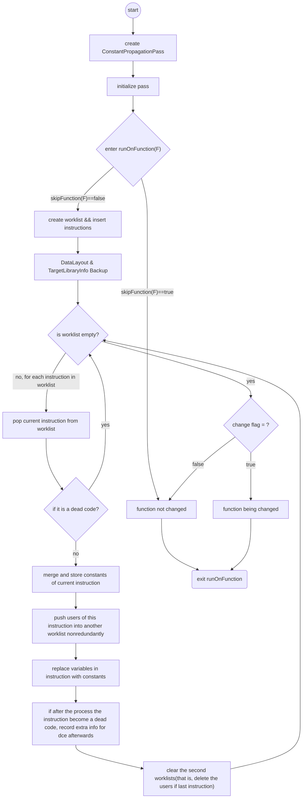

# lab3-2实验报告

组长：PB17111560 李宇轩  组员：PB17111571 冷博洋   PB17071401 吴舜钰

## 实验要求

本次试验中，我么要阅读LLVM Pass的介绍学会使用opt工具，同时阅读源代码来了解LLVM中如何使用Pass对IR进行优化。在助教给出的两组Pass中各选择一个，介绍该Pass的类型和使用，用该Pass进行LLVM IR的优化，同时叙述该Pass的流程。我们小组选择的Pass是constprop和tailcallelim。

## 报告内容 

### 任务1：介绍Pass类型和作用

**constprop 简单常量传播**：   constprop Pass是 TranForm Pass中的一种。该Pass用来实现常量的传播和合并。该Pass寻找只包含常量操作数的指令，并且用常量值代替指令替换他们。下面举一个例子。

例如：优化之前
```C++
add i32 1,2
```
优化之后
```C++
i32 3
```
在此Pass中有部分注释为：
```C++
// Notice that:
//   * This pass has a habit of making definitions be dead.  It is a good idea
//     to run a DIE pass sometime after running this pass.
```
说明该Pass有让定义失效的习惯，所以一般会在运行此Pass后运行死指令消除的Pass。

### 任务2: IR优化

- 使用的test

  ```c
  int main() {
  	int a,b,c;
  	a=1;
  	b=2;
  	c=a+b;
  	return c;
  }
  ```

  - 自动生成的.ll文件去掉无关属性后

  ```ll
  ; ModuleID = 'cnstprop2.c'
  source_filename = "cnstprop2.c"
  target datalayout = "e-m:e-i64:64-f80:128-n8:16:32:64-S128"
  target triple = "x86_64-unknown-linux-gnu"
  
  ; Function Attrs: noinline nounwind optnone uwtable
  define dso_local i32 @main() #0 {
    %1 = alloca i32, align 4
    %2 = alloca i32, align 4
    %3 = alloca i32, align 4
    %4 = alloca i32, align 4
    store i32 0, i32* %1, align 4
    store i32 1, i32* %2, align 4
    store i32 2, i32* %3, align 4
    %5 = load i32, i32* %2, align 4
    %6 = load i32, i32* %3, align 4
    %7 = add nsw i32 %5, %6
    store i32 %7, i32* %4, align 4
    %8 = load i32, i32* %4, align 4
    ret i32 %8
  }
  ```

  - **注**：*The constant propagation pass, like many other passes, assumes [mem2reg](http://llvm.org/docs/Passes.html#mem2reg-promote-memory-to-register) has been used on the code first.*
  - 使用`-mem2reg`优化后

  ```ll
  ; ModuleID = 'cnstprop2.ll'
  source_filename = "cnstprop2.c"
  target datalayout = "e-m:e-i64:64-f80:128-n8:16:32:64-S128"
  target triple = "x86_64-unknown-linux-gnu"
  
  define dso_local i32 @main() {
    %1 = add nsw i32 1, 2
    ret i32 %1
  }
  
  ```

  - **注**： *标记`nsw`指出这个加法操作没有有符号回绕（no signed wrap），这表示指令已知没有溢出，允许某些优化*
  - 对上面IR使用`-constprop`选项优化后

  ```ll
  ; ModuleID = 'cnstprop2.ll'
  source_filename = "cnstprop2.c"
  target datalayout = "e-m:e-i64:64-f80:128-n8:16:32:64-S128"
  target triple = "x86_64-unknown-linux-gnu"
  
  define dso_local i32 @main() {
    ret i32 3
  }
  
  ```

  该Pass的优化部分是将add 1, 2合并为3，并传入`%1`

  即将` %1 = add nsw i32 1, 2`,  ` ret i32 %1`两句变为`ret i32 3`

  

### 任务3: PASS流程分析

1. 创建新的`ConstantPropagationPass()`
2. 初始化常量传播Pass
3. 进入`runOnFunction`
4. 若要跳过该函数，返回false，表示该函数未更改
5. 若不跳过该函数，创建一个工作列表
6. 把该函数中所有指令插入该工作列表
7. 记录当前的`DataLayout`和`TargetLibraryInfo`信息备用
8. 若当前工作列表不为空（即程序含有非零条指令），对工作列表中每条指令，进行以下操作：(列表为空直接返回未更改)
   - 将其弹出工作列表
   - 如果该指令不是Dead code
     - 利用7中存储的`DataLayout`和`TargetLibraryInfo`信息处理该指令中可能出现的常数，merge常量(即将算术表达式的值求出)，然后将这些常量存入C数组，[C存储**I**指令涉及到所有常量]
     - 不重复的将这条指令中的user存入一个新的工作列表
     - 将该指令I中的可以被替换的变量替换为常数，这些信息已经被记录在C中
     - 如果这些处理结束后查`TargetLibraryInfo`发现该指令变成了一条Dead code, 记录待删信息，以备之后死代码删除优化使用
     - 记录下这个函数被更改的信息，即记录返回值为true, 继续处理下一条指令
   - 若该指令是Dead Code，不做任何处理
   - 上一条指令处理完后，从第二个工作列表里清除旧的users
9. 返回函数是否被更改的信息
10. 退出runOnFunction




**tailcallelim 尾部调用删除**：tailcallelim Pass同样也是TranForm Pass中的一种。该Pass将当前的函数的调用（该函数是自递归的）转换为函数入口的返回指令（带有分支），从而来创建一个循环。还实现了对下面的基础算法的以下扩展：

1.调用和返回之间的简单指令并不能阻止转换的发生，尽管目前的分析不能支持移动任何真正有用的指令（只有死指令）。

2.该Pass通过将一个关联表达式转化为使用累加器变量来阻止函数进行尾部递归，从而将典型简单的例子例如阶乘或fib编译为高效代码。

3.当下列情况是执行TRE：函数返回void；函数返回返回调用所返回的结果；函数返回函数所有出口运行时的常量。函数可以返回一些其他的东西（比如说常量0）并且能够被执行。如果函数中所有其他的返回指令都返回相同的值，则可以重新设置。

4.如果被调用者不访问他们的调用者堆栈帧，则这些被调用者可以由代码生成器标记为有资格进行尾部调用删除。

## 实验总结

此次实验有什么收获

## 实验反馈

对本次实验的建议（可选 不会评分）
